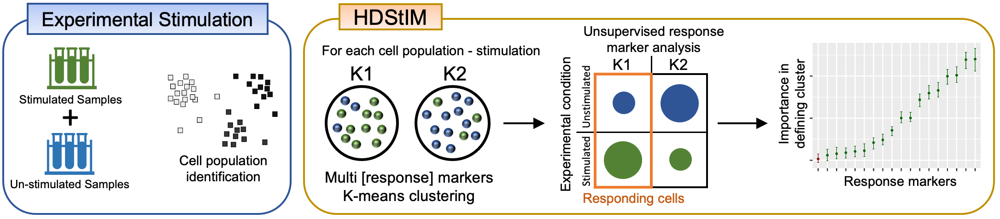

# Google Colab interface to HDStIM (High Dimensional Stimulation Immune Mapping)

## Abstract
HDStIM is a method for identifying responses to experimental stimulation in mass or flow cytometry that uses high dimensional analysis of measured parameters and can be performed with an end-to-end unsupervised approach. In the context of in vitro stimulation assays where high-parameter cytometry was used to monitor intracellular response markers, using cell populations annotated either through automated clustering or manual gating for a combined set of stimulated and unstimulated samples, 'HDStIM' labels cells as responding or non-responding. The package also provides auxiliary functions to rank intracellular markers based on their contribution to identifying responses and generating diagnostic plots. 

*Figure 1. Schematic outline for the use of multiple response markers by HDStIM to identify cells with a responding phenotype from unstimulated and stimulated experimental samples for a given stimulation - cell population combination.*
 
## Colab notebook
This notebook is an attempt to make it easier to use HDStIM. However, since it runs on Google Colab, it has its limitations. For example, uploading a large dataset is very slow and may not be straightforward. Also, the marker ranking function that utilizes multiple cores may be orders of magnitude slower than on a local machine with more than two cores. See the more information section at the bottom of the notebook on how to run this notebook locally (recommended).

| Notebook | Link |
| -------- | ---- |
| ColabHDStIM.ipynb |  |

*Note: Under default settings, the notebook should be able to run an example dataset.*

## Helpful links
1. HDStIM related
   1. Documentation website: [https://niaid.github.io/HDStIM/](https://niaid.github.io/HDStIM/) 
   2. Source code: [https://github.com/niaid/HDStIM/](https://github.com/niaid/HDStIM/) 
   3. CRAN page: [https://cran.r-project.org/package=HDStIM](https://cran.r-project.org/package=HDStIM)
2. Google colab related
   1. [Google Colab frequently asked questions](https://research.google.com/colaboratory/faq.html)
   2. [Welcome to Colab!](https://colab.research.google.com/)
   3. [Practical introduction to Google Colab for data science (YouTube video)](https://www.youtube.com/watch?v=oCngVVBSsmA)

## Citation
To cite ColabHDStIM:

* Rohit Farmer. (2022). ColabHDStIM: A Google Colab interface to HDStIM (High Dimensional Stimulation Immune Mapping) (v1.1.0). Zenodo. https://doi.org/10.5281/zenodo.7231731
* Rohit Farmer, Richard Apps, Juan Quiel, Brian Sellers, Foo Cheung, Jinguo Chen, Amrita Mukherjee, Peter McGuire, John S Tsang. (2022). Multiparameter stimulation mapping of signaling states in single pediatric immune cells reveals heightened tonic activation during puberty. bioRxiv 2022.11.14.516371. https://doi.org/10.1101/2022.11.14.516371